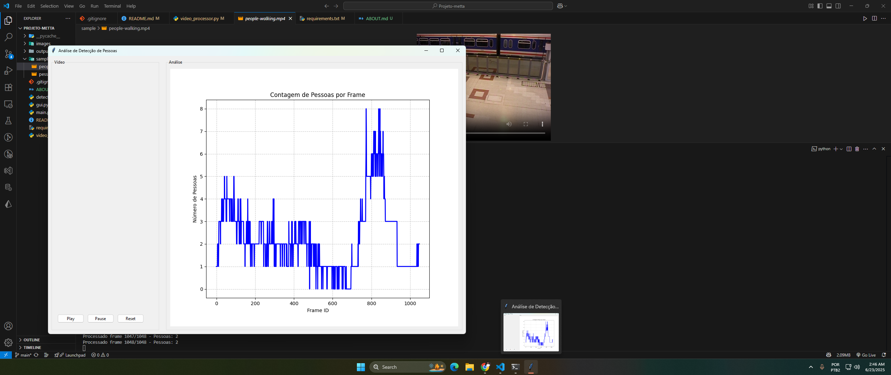

# ABOUT.md — Detecção de Pessoas com Análise em Vídeo

## Objetivo da Solução
A aplicação foi desenvolvida para processar um vídeo de entrada, detectar pessoas em cada frame utilizando uma **rede neural pré-treinada (Faster R-CNN)** e gerar análises com contagens e alertas(contagens acima do limiar) em arquivos `.json`. Além disso, uma interface gráfica exibe o vídeo processado e um gráfico com o histórico de detecções.

---

## Tecnologias e Bibliotecas Utilizadas

| Tecnologia      | Uso Principal                                      |
|-----------------|---------------------------------------------------|
| **Python 3.10+** | Linguagem base                                    |
| **OpenCV**       | Leitura e escrita de vídeos; manipulação de frames|
| **PyTorch**      | Execução do modelo de rede neural pré-treinado    |
| **Torchvision**  | Acesso ao modelo Faster R-CNN                     |
| **Tkinter**      | Construção da GUI                                 |
| **Matplotlib**   | Geração de gráfico de detecção na GUI             |
| **Pillow**       | Exibição de imagens no Tkinter                    |

---

##  Abordagem Técnica

### 1. Arquitetura Modular

O projeto foi dividido em módulos especializados para garantir manutenibilidade e reutilização de código.

| Arquivo             | Função Principal                                       |
|---------------------|--------------------------------------------------------|
| `detector.py`       | Detecta pessoas com Faster R-CNN                       |
| `video_processor.py`| Processa frames, registra histórico e alertas         |
| `gui.py`            | Apresenta GUI com vídeo e gráfico                     |
| `main.py`           | Coordena a execução da aplicação                       |

---

### 2. Rede Neural Pré-Treinada

O modelo utilizado é o `Faster R-CNN` com backbone `ResNet-50 FPN`, pré-treinado no dataset COCO. Esse modelo foi escolhido por:

- Alta acurácia na detecção de pessoas
- Integração direta via `torchvision.models.detection`
- Compatibilidade com CPU e GPU

---

## Funcionalidades Implementadas

-  Leitura frame a frame de um vídeo de entrada
-  Detecção de pessoas com bounding boxes
-  Registro por frame da contagem de pessoas (`history.json`)
-  Geração de alertas (`alerts.json`) quando o número de pessoas ultrapassa um limite definido via argumento
-  Vídeo final com as detecções desenhadas (`output_video.mp4`)
-  Interface gráfica com player de vídeo + gráfico de contagem por frame

## Passos da Execução do Sistema de Detecção

1. **Especificar o caminho do vídeo**  
   

2. **Configurar os parâmetros de entrada**  
   

3. **Inicialização do detector de pessoas**  
   

4. **Processamento concluído - GUI disponível**  
   

5. **Visualização inicial na GUI**  
   

6. **Reprodução do vídeo processado**  
   

7. **Controles de execução**  
   

8. **Finalização da GUI**  
   

9. **Arquivo de alertas gerado**  
   

10. **Histórico de detecções**  
    

11. **Vídeo processado**  
    